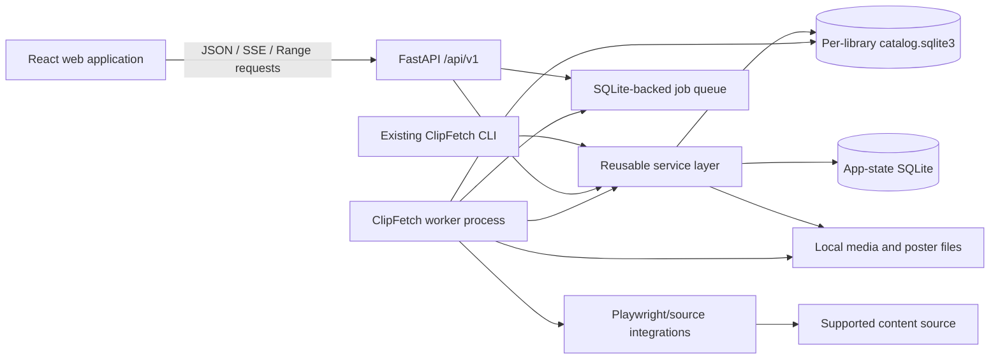
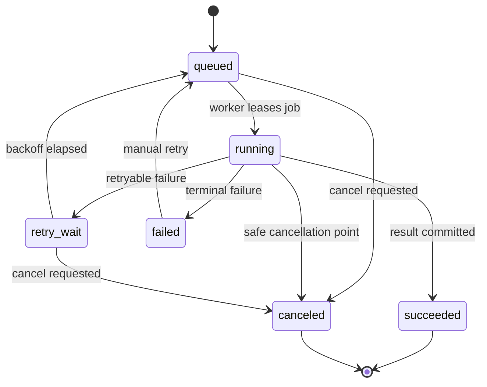

# ClipFetch Watch: Product, Design, and Engineering Plan

**Status:** Proposed implementation blueprint
**Audience:** Product, design, frontend, backend, and QA contributors
**Scope:** A modern, local-first “streaming service for short content” built on ClipFetch
**Recommended repository strategy:** Build it in this repository as a monorepo
**Working product name:** ClipFetch Watch

> “Netflix for reels” describes the browsing quality and content organization, not a literal Netflix clone. ClipFetch Watch should borrow the familiar streaming grammar—hero content, curated rails, categories, continue-watching, and rich detail views—while using an original identity and a player designed specifically for vertical, short-form media.

---

## 1. Executive decision

Build the first version in the existing ClipFetch repository. Keep the Python downloader, catalog, topics, collections, transcription, semantic search, and duplicate detection as the content engine. Add:

1. A reusable Python service layer beneath both the CLI and web API.
2. A versioned local HTTP API using FastAPI.
3. A React, TypeScript, and Vite frontend in `web/`.
4. A worker process for downloads and expensive enrichment work.
5. A small application-state database for playback, favorites, jobs, and UI preferences.
6. A production build that can be served by the Python package and launched with one command.

The first release should remain local-first and single-user. It should bind to `127.0.0.1`, play files already in a ClipFetch library, allow new downloads, expose topic/category browsing, and work without a cloud account.

Do not begin with microservices, cloud transcoding, social accounts, multi-user profiles, DRM, or a separate frontend repository. Those choices add operational complexity before the product loop has been validated.

### Recommended stack

| Layer | Choice | Why |
|---|---|---|
| Web UI | React + TypeScript + Vite | Fast local development, mature video UI ecosystem, clear production build |
| Styling | CSS Modules + CSS custom-property design tokens | Distinctive visual identity without coupling every component to a utility framework |
| Routing | React Router | Explicit, linkable screens and browser navigation |
| Server state | TanStack Query | Caching, request lifecycle, retry, and invalidation for API state |
| Local UI state | React context/reducers | Enough for player, navigation, and modal state without another global-state dependency |
| HTTP API | FastAPI under `/api/v1` | Typed contracts, generated OpenAPI, streaming responses, WebSocket/SSE support |
| Persistent catalog | Existing per-library SQLite database | Preserves ClipFetch’s portable, local-first library model |
| App state | Separate SQLite database | Keeps playback and device-specific state out of the portable media catalog |
| Media delivery | HTTP byte-range MP4 for MVP | Browser seeking without a transcoding pipeline |
| Job updates | Server-Sent Events with polling fallback | Simple one-way progress stream for downloads and enrichment |
| Long-running work | Separate Python worker process | Prevents Playwright, downloads, transcription, and media analysis from blocking the API |
| E2E tests | Playwright | Real-browser verification of browsing, playback, keyboard, and responsive behavior |

Dependency versions should be pinned when implementation begins and tested against the project’s supported Python and Node versions. Do not silently drop ClipFetch’s existing Python compatibility without an explicit compatibility decision.

---

## 2. Product vision

ClipFetch Watch turns a folder of downloaded short videos into an intentional viewing library.

Instead of opening files one by one or endlessly scrolling an algorithmic feed, the user sees a calm, high-quality streaming interface organized around their own topics, collections, searches, and viewing history. They can move between lean-back discovery and focused vertical viewing without leaving their local library.

The core promise is:

> Collect short-form content once, then search, organize, and watch it like a personal streaming service.

### 2.1 Product principles

1. **The library belongs to the user.** Media and catalog data stay local by default.
2. **Browsing should feel editorial, not chaotic.** Categories, collections, and contextual rails are more important than an infinite engagement feed.
3. **Playback is reel-native.** The main player respects 9:16 media, captions, gestures, keyboard controls, and rapid next/previous navigation.
4. **Quality is explainable.** “High quality” should describe media properties or a clearly defined score, not an unexplained popularity label.
5. **Every screen should work with a small library.** Empty states and sparse categories must feel intentional.
6. **Automation remains inspectable.** Download and enrichment jobs show their status, failures, and retry actions.
7. **Accessibility is part of the design.** Keyboard navigation, visible focus, captions, reduced motion, and adequate targets are release requirements.
8. **The CLI remains first-class.** The web app and CLI use the same services and catalog rules.

### 2.2 Primary users

#### The collector

Saves useful or entertaining reels from many sources and wants a reliable local archive.

Needs:

- Quick URL submission.
- Visible download progress and failure recovery.
- Duplicate protection.
- Reliable metadata and best-available rendition selection.

#### The topic viewer

Wants a focused stream such as recipes, fitness, travel, software, design, or comedy.

Needs:

- Topic landing pages.
- A “Play this topic” action.
- Filters for quality, duration, creator, date, and availability.
- Related topics and collections.

#### The researcher

Uses transcripts, captions, comments, and semantic search to find specific moments or ideas.

Needs:

- Text and semantic search.
- Transcript visibility and time-linked search results where possible.
- Saved dynamic collections.
- Stable source links and metadata provenance.

#### The lean-back viewer

Wants the library to surface something good with minimal effort.

Needs:

- Continue Watching.
- Recently Added.
- High-Quality Picks.
- Topic and collection rails.
- Smooth next-item playback without surprise audio on page load.

### 2.3 Product goals

- Make a downloaded ClipFetch library browsable from a modern visual interface.
- Let users enter a topic or category and watch a continuous sequence of matching clips.
- Let users add new source URLs and follow the work through completion.
- Make local playback responsive, seekable, and reliable.
- Expose existing ClipFetch capabilities instead of reimplementing them in JavaScript.
- Establish service and API boundaries that can support a future desktop or remote client.

### 2.4 Non-goals for the MVP

- Recreating Instagram, TikTok, or YouTube’s social network.
- Logging into third-party services from the web UI.
- Scraping an endless remote feed.
- Cloud hosting, cloud synchronization, or multi-device accounts.
- Multi-user profiles and parental controls.
- Creator uploads or collaborative libraries.
- DRM.
- Server-side transcoding or adaptive bitrate streaming.
- A public URL reachable from the internet.
- An engagement-maximizing recommendation model.

---

## 3. Success criteria

### 3.1 MVP acceptance criteria

The MVP is complete when a user can:

1. Launch the app with one documented command.
2. Select or register a ClipFetch library.
3. See useful home rails populated from that library.
4. Open a topic, collection, search result, or clip detail page.
5. Start playback and seek through a local MP4.
6. Move to the next or previous clip by keyboard, click, swipe, or scroll.
7. resume a partially watched clip.
8. Favorite and unfavorite a clip.
9. Submit a supported permalink for download.
10. See queued, running, completed, failed, canceled, and retried jobs.
11. Filter for objectively measured high-resolution/high-bitrate media.
12. Use the major flows with only a keyboard and visible focus.
13. Run the complete automated test suite without requiring live third-party sites.

### 3.2 Product metrics

No analytics should leave the device by default. If local product metrics are implemented, keep them aggregate and inspectable.

Suggested local metrics:

- Time from app launch to first playable rail.
- Playback-start success rate.
- Percentage of media files with extracted dimensions and duration.
- Search-to-play conversion.
- Download completion/failure rate by error category.
- Continue Watching completion rate.
- Percentage of clips with a topic, caption, transcript, and poster.
- Duplicate rate avoided during ingestion.

### 3.3 Initial performance budgets

These are target budgets on a typical developer laptop with a local library:

| Operation | Target |
|---|---:|
| App shell visible | under 1.0 s after server readiness |
| First useful home rail | under 1.5 s |
| Standard list API p95 | under 100 ms for a warmed database |
| Clip detail API p95 | under 75 ms |
| Playback start from local SSD | under 500 ms after user action |
| Poster payload | normally under 100 KB |
| Initial rail payload | no more than 12–20 cards per rail |
| Concurrent prefetched videos | active clip plus at most one adjacent clip |

Large libraries must use cursor pagination, indexed filters, lazy poster loading, and list virtualization where necessary.

---

## 4. Information architecture

### 4.1 Primary navigation

Desktop navigation:

- Home
- Explore
- Topics
- Collections
- Downloads
- My Library
- Search
- Settings

Mobile navigation:

- Home
- Explore
- Search
- Library
- Downloads

Topics and Collections remain reachable from Explore and Library on compact screens.

### 4.2 Route map

```text
/
├── /onboarding
├── /home
├── /explore
├── /topics
│   └── /topics/:topicSlug
├── /collections
│   └── /collections/:collectionId
├── /search?q=...
├── /watch/:clipId
├── /clip/:clipId
├── /downloads
├── /library
│   ├── /favorites
│   ├── /recent
│   ├── /creators/:creatorId
│   └── /unavailable
└── /settings
    ├── /libraries
    ├── /playback
    ├── /downloads
    ├── /appearance
    └── /diagnostics
```

The browser URL should preserve the active destination. A detail view may appear as a modal over a rail on desktop, but direct navigation to `/clip/:clipId` must render a full page and remain shareable within the local app.

---

## 5. Experience design

### 5.1 Onboarding and library selection

The first launch should not drop the user into an empty streaming shell.

#### First-run screen

Content:

- ClipFetch Watch wordmark.
- One-sentence value proposition.
- “Open an existing library” primary action.
- “Create a new library” secondary action.
- A short privacy statement: local files, local catalog, no telemetry by default.
- A link to supported content-source documentation.

Behavior:

- Use the host-side directory picker where packaging allows it.
- For browser-only development, accept a server-readable path through a validated form.
- Validate that the directory exists and is readable.
- Detect an existing `.clipfetch/catalog.sqlite3` database.
- If no catalog exists, explain that initialization will create ClipFetch metadata only; do not write until the user confirms.
- Never let the browser submit arbitrary paths directly to media endpoints.

#### Returning launch

- Restore the last-opened library if it still exists.
- If it is unavailable, show a recovery screen with “Locate library,” “Choose another,” and “Remove from recent.”
- Never display internal stack traces or raw filesystem paths in the standard error UI.

### 5.2 Home

Home uses streaming-service browsing grammar with short-content density.

#### Hero area

The hero should feature one strong, playable clip or collection rather than a full-screen autoplaying background.

Include:

- Poster or muted six-second preview only after deliberate hover/focus and only when reduced motion is off.
- Topic or collection eyebrow.
- Short title/caption with a strict line limit.
- Creator and duration.
- “Play” primary action.
- “Details” secondary action.
- Optional reasons such as “Recently added” or “From your Design topic.”

Do not autoplay audible media. On mobile, use a static poster to avoid bandwidth and battery waste.

#### Default rail order

Show only rails that have enough useful content:

1. Continue Watching.
2. Recently Added.
3. Favorites.
4. High-Quality Picks.
5. Topic rails, ordered by library coverage and recent use.
6. Saved collections.
7. Short and Useful, for clips below a configurable duration.
8. Rediscover, for unwatched older items.
9. Needs Attention, for unavailable media or incomplete enrichment, only when relevant.

Each rail includes:

- A meaningful title.
- Optional one-line description.
- “See all” destination.
- Horizontal keyboard and pointer navigation.
- 6–12 initial cards, followed by lazy pagination.
- A stable order for the duration of a browsing session.

Do not render five differently named rails containing almost the same clips. Apply cross-rail deduplication to the initial viewport.

### 5.3 Explore

Explore is a discovery surface, not a second Home page.

Controls:

- Topic chips.
- Sort: Recommended, Newest, Oldest, Most Liked, Most Viewed, Duration.
- Quality: Any, HD, Full HD, Higher than Full HD, Best Available.
- Duration ranges.
- Creator.
- Availability.
- Caption/transcript availability.
- Download date range.
- Grid density toggle on larger screens.

The filter state belongs in the URL so a view can be reloaded or bookmarked. Use a removable-filter summary above results. On mobile, filters open in a bottom sheet with Apply and Reset actions.

### 5.4 Topic and category pages

Each topic page should feel like a small channel.

Header:

- Topic name.
- Clip count and total watch time.
- “Play topic” button.
- “Shuffle” button.
- Optional generated description based only on local metadata, clearly labeled when generated.
- Related topics.

Content:

- Featured clips.
- New in this topic.
- Most popular in this topic.
- High-quality clips.
- Creators represented.
- All clips grid.

Topics come from ClipFetch’s existing topic rules and metadata. The UI should not create a competing hidden taxonomy. User-created topic aliases or merges can be a later catalog feature.

### 5.5 Collections

Collections retain their current meaning: saved, dynamic filter definitions rather than copied media lists.

Collection detail shows:

- Name and optional description.
- Current clip count.
- Human-readable filter summary.
- Last evaluated timestamp.
- Play and shuffle actions.
- Edit filters.
- Export definition.
- Empty-state explanation if the dynamic query currently matches nothing.

Editing a collection should produce the same query semantics as the CLI. Both surfaces must call the same validation and query services.

### 5.6 Search

Search should combine fast structured lookup and semantic discovery.

#### Search modes

- **All:** blended results.
- **Text:** caption, creator, transcript, comments, topic, and identifier matches.
- **Meaning:** semantic similarity using the existing embedding index.
- **Creators.**
- **Topics.**
- **Collections.**

#### Search behavior

- Debounce text input by roughly 200–300 ms.
- Do not run semantic model initialization on every keystroke.
- Show recent local searches, with a clear-history action.
- Highlight matched text without altering transcript content.
- Explain semantic matches with a restrained label such as “Similar meaning.”
- Offer filters that use the same URL representation as Explore.
- If semantic dependencies or an index are unavailable, preserve text search and show an actionable semantic-search state.

#### Search result cards

Include:

- Poster.
- Caption/title.
- Creator.
- Duration.
- Topic chips.
- Quality badge when known.
- Text snippet or transcript excerpt that explains the match.
- Availability state.

### 5.7 Clip detail

The detail view supplies context before playback.

Desktop layout:

- Large 9:16 poster/video area on the left.
- Metadata and actions on the right.
- Transcript, caption, comments summary, technical details, and related clips below.

Actions:

- Play or resume.
- Favorite.
- Add to or create collection.
- Open stable source permalink.
- Reveal file in the operating system when packaged locally.
- Copy identifier.
- Re-run metadata, transcript, topic, poster, or media analysis when supported.
- Delete from library only behind a separate, explicit confirmation flow; deletion is post-MVP unless catalog semantics are already safe.

Metadata:

- Creator.
- Download date.
- Source publication date when available.
- Likes/views/comments with “captured at” context.
- Duration and dimensions.
- Codec, bitrate, file size, and rendition label.
- Topics.
- Caption and transcript.
- Duplicate/near-duplicate relationship when available.
- Stable source permalink.

Never expose temporary CDN URLs, session cookies, or raw captured request payloads.

### 5.8 Immersive player

The player is the product’s defining surface.

#### Desktop composition

- Dark stage occupying the viewport.
- Centered vertical video, constrained to available height.
- Previous/next preview slivers or navigation affordances, without distracting from the active clip.
- Right action rail: favorite, details, transcript, source.
- Bottom overlay: caption/title, creator, topics, progress, mute, captions, and quality information.
- Collapsible queue panel for the current topic, collection, or search context.

#### Mobile composition

- Full-height vertical pager.
- One clip active at a time.
- Swipe/scroll up for next and down for previous.
- Tap to reveal controls; do not overload single tap if it conflicts with pause.
- Actions aligned to a reachable side rail.
- Caption and creator content above the safe-area bottom inset.
- System back returns to the originating rail and restores scroll position.

#### Playback rules

- Playback begins only after a user gesture unless the browser permits a muted transition from an already active player.
- Preserve mute preference locally.
- Preload metadata for the active and next item; never preload an entire rail’s videos.
- Pause when the player is not visible or the page is backgrounded.
- Save progress periodically, on pause, on item change, and on page close.
- Treat at least 90% watched or the final few seconds as complete.
- Completed short clips normally restart from zero; partially watched clips resume.
- A setting controls whether the next clip starts automatically.
- A setting controls whether captions default on when available.
- A failed clip remains in context with Retry, Skip, Details, and Locate File actions.

#### Input model

| Input | Action |
|---|---|
| Space / K | Play or pause |
| Arrow Up / Page Up | Previous clip |
| Arrow Down / Page Down | Next clip |
| Arrow Left / Right | Seek backward/forward |
| J / L | Seek backward/forward by a larger step |
| M | Mute/unmute |
| C | Toggle captions |
| F | Fullscreen |
| I | Open details |
| Escape | Close overlay/player and return to origin |
| Swipe up/down | Next/previous on touch devices |

Do not trap keyboard focus. Announce the newly active clip through an appropriately restrained live region. Player controls must have accessible names and visible focus styles.

### 5.9 Downloads and jobs

The Downloads screen is a transparent work queue.

#### Add-content form

- One or multiple stable post permalinks.
- Destination library.
- Quality preference using ClipFetch’s existing rendition semantics.
- Optional enrichment choices: transcript, topics, comments, duplicate analysis.
- Validation before submission.
- Plain-language note that source availability and authentication may affect success.

#### Job list

Group by Active, Needs Attention, and History.

Every job shows:

- Source host and stable permalink.
- Current phase.
- Progress where it is actually measurable.
- Started/finished timestamps.
- Resulting clip link.
- Retry, cancel, and dismiss actions where valid.
- A concise public error category.
- Expandable technical diagnostics with secrets and sensitive paths redacted.

Do not show fictional percentage progress for indeterminate browser navigation. Use phase labels and an activity indicator until byte progress becomes available.

### 5.10 Library

The Library area provides dependable inventory views:

- All clips.
- Favorites.
- Recently added.
- Recently watched.
- Creators.
- Topics.
- Collections.
- Unavailable media.
- Missing enrichment.
- Duplicate groups.

Grid cards should be compact but legible. Hover can reveal actions on pointer devices; the same actions must remain available through focus and the detail view.

### 5.11 Settings and diagnostics

Settings:

- Registered libraries and default library.
- Playback behavior.
- Caption preference.
- Download quality default.
- Enrichment defaults.
- Storage and cache locations.
- Appearance and reduced-motion override.
- Keyboard shortcut reference.
- Version and dependency capabilities.

Diagnostics:

- API health.
- Active library health.
- Catalog schema version.
- Worker heartbeat.
- Optional-feature availability.
- Media counts by availability/enrichment state.
- Export sanitized diagnostic bundle.

Diagnostics must not include cookies, tokens, temporary media URLs, raw browser storage, or full filesystem paths unless the user explicitly opts into a local-only detailed export.

### 5.12 Empty, error, and offline states

Every major surface needs designed states:

- No library registered.
- Empty library.
- No clips in a topic or filter.
- Missing media file.
- Corrupt or unsupported media.
- Semantic index unavailable.
- Worker unavailable.
- Download authentication required.
- Catalog migration required.
- API disconnected while the shell is open.

Use a clear title, one-sentence explanation, primary recovery action, and secondary diagnostic action. Avoid generic “Something went wrong” screens when a known recovery exists.

---

## 6. Visual design system

### 6.1 Design direction

The interface should feel cinematic, calm, and premium, but denser and more personal than a television streaming app. Its identity should come from vertical media, crisp metadata, editorial rails, and a coral-to-violet light treatment—not Netflix’s logo, exact red, typography, or artwork treatment.

Keywords:

- Cinematic
- Editorial
- Focused
- Tactile
- Fast
- Personal
- Dark without becoming muddy

Avoid:

- A literal black-and-red Netflix copy.
- Excessive glassmorphism.
- Tiny gray text on black.
- Constant autoplay motion.
- Neon gradients on every element.
- Rounded cards so soft that the interface feels like a generic mobile dashboard.
- Engagement counters dominating the content.

### 6.2 Color tokens

Initial dark theme:

```css
:root {
  --color-bg: #07080b;
  --color-bg-subtle: #0b0d12;
  --color-surface: #11141a;
  --color-surface-raised: #181c24;
  --color-surface-hover: #202632;
  --color-border: #2a303c;
  --color-border-subtle: #1d222c;

  --color-text: #f7f8fa;
  --color-text-secondary: #b6bdca;
  --color-text-muted: #858e9e;
  --color-text-inverse: #090a0d;

  --color-accent: #ff4d67;
  --color-accent-hover: #ff6b80;
  --color-accent-pressed: #e83d57;
  --color-accent-violet: #8b5cf6;

  --color-success: #2dd4bf;
  --color-warning: #fbbf24;
  --color-danger: #f43f5e;
  --color-info: #60a5fa;
  --color-focus: #7dd3fc;

  --overlay-scrim: rgb(2 3 6 / 72%);
  --overlay-player: linear-gradient(180deg, transparent 45%, rgb(3 4 8 / 88%) 100%);
}
```

Rules:

- Accent color highlights primary actions and the active destination; it is not body text.
- White text on accent must be contrast-tested at actual button sizes.
- Muted text still needs sufficient contrast for its role.
- Quality, availability, and job states must use icons or labels as well as color.
- Artwork gradients derive from poster colors only in hero backgrounds and should be cached, not recalculated on every render.

A light theme can be added after the dark experience is complete. Do not weaken the dark theme to make both themes ship simultaneously in the MVP.

### 6.3 Typography

Use a performance-safe system stack initially, with an optional bundled variable font later. Do not fetch fonts from a third-party CDN by default.

Suggested stack:

```css
font-family: Inter, ui-sans-serif, system-ui, -apple-system, BlinkMacSystemFont,
  "Segoe UI", sans-serif;
```

Type scale:

| Token | Desktop | Mobile | Use |
|---|---:|---:|---|
| Display | 48/52, 700 | 34/38, 700 | Hero titles only |
| H1 | 36/42, 700 | 28/34, 700 | Page titles |
| H2 | 26/32, 650 | 22/28, 650 | Rail and section titles |
| H3 | 20/26, 650 | 18/24, 650 | Card groups and dialogs |
| Body | 16/24, 400 | 16/24, 400 | Standard copy |
| Body small | 14/20, 400 | 14/20, 400 | Metadata |
| Label | 13/16, 600 | 13/16, 600 | Controls and badges |
| Micro | 11/14, 650 | 11/14, 650 | Rare compact technical labels |

Caption/title text over video must have a gradient or scrim and remain readable across bright and dark frames.

### 6.4 Spacing, shape, and elevation

Spacing scale:

```text
2, 4, 8, 12, 16, 20, 24, 32, 40, 48, 64, 80 px
```

Radius scale:

```text
small: 6 px
control: 10 px
card: 12 px
panel: 16 px
pill: 999 px
```

Use restrained shadows and a one-pixel border to separate raised dark surfaces. The active card may scale to approximately `1.03` on pointer hover, but layout must reserve enough space to avoid clipping or shifting neighboring cards.

### 6.5 Clip cards

Default cards use a 9:16 poster.

Variants:

- **Portrait card:** primary rail/grid card.
- **Continue card:** portrait card with progress bar and Resume label.
- **Landscape editorial card:** only for featured collections or topic banners.
- **Compact result row:** search and job results.
- **Technical card:** unavailable/diagnostic media.

Portrait card anatomy:

1. Poster.
2. Optional duration in lower-right corner.
3. Optional quality badge in upper-left corner.
4. Availability/download state in upper-right corner only when needed.
5. Caption/title below the artwork, maximum two lines.
6. Creator or topic as secondary text.
7. Progress bar at the artwork bottom for partially watched clips.

Card metadata must not depend on hover. Hover may add quick actions, preview, or a richer popover.

### 6.6 Motion

Motion should communicate state and spatial continuity.

| Motion | Duration | Notes |
|---|---:|---|
| Control feedback | 100–140 ms | Opacity/color/press |
| Card hover | 160–200 ms | Small scale and elevation |
| Drawer/modal | 220–280 ms | Ease-out entry, faster exit |
| Player item transition | 240–320 ms | Vertical translation aligned with gesture |
| Skeleton shimmer | Avoid if possible | Prefer low-motion pulse |

When `prefers-reduced-motion: reduce` is active:

- Disable poster zoom and autoplay previews.
- Replace sliding transitions with short fades or immediate state changes.
- Stop nonessential looping animation.
- Preserve all functional state feedback.

### 6.7 Responsive behavior

Suggested breakpoints are implementation tools, not device labels:

```text
compact: < 640 px
medium: 640–1023 px
large: 1024–1439 px
wide: >= 1440 px
```

Guidelines:

- Rail cards grow smoothly rather than snapping through too many fixed sizes.
- Home horizontal padding ranges from 16 px on compact screens to 64 px on wide screens.
- Desktop navigation can become compact/icon-led on medium screens.
- Detail layout becomes a stacked view below the large breakpoint.
- The player uses dynamic viewport units and safe-area insets on mobile.
- Touch targets should meet a minimum 44-by-44 CSS pixel internal target, with additional spacing where controls cluster.
- Hover-only behavior must have touch and keyboard equivalents.

### 6.8 Accessibility requirements

Target WCAG 2.2 AA for the web interface.

Release requirements:

- Full keyboard operation.
- Visible focus that is not hidden by sticky content.
- Logical focus order.
- Skip link to main content.
- Semantic headings and landmarks.
- Accessible names for icon controls.
- Captions when caption/transcript data can be synchronized; otherwise a clearly separate transcript.
- User control over audio and autoplay.
- Pause/stop controls for moving previews.
- Reduced-motion support.
- Sufficient color contrast.
- Error messages tied to their fields.
- Status messages announced without stealing focus.
- Pointer targets large enough for touch.
- No required gesture without an equivalent button/control.

Automated accessibility checks are necessary but insufficient. Keyboard and screen-reader smoke tests belong in the release checklist.

---

## 7. Repository strategy and proposed structure

Keep the application in the current repository until the frontend has an independent release cadence, team, or public deployment target.

```text
ClipFetch/
├── clipfetch/
│   ├── api/
│   │   ├── app.py
│   │   ├── dependencies.py
│   │   ├── errors.py
│   │   ├── models.py
│   │   └── routes/
│   │       ├── bootstrap.py
│   │       ├── clips.py
│   │       ├── collections.py
│   │       ├── jobs.py
│   │       ├── libraries.py
│   │       ├── media.py
│   │       ├── search.py
│   │       ├── state.py
│   │       └── topics.py
│   ├── services/
│   │   ├── catalog_service.py
│   │   ├── collection_service.py
│   │   ├── download_service.py
│   │   ├── home_service.py
│   │   ├── library_service.py
│   │   ├── media_service.py
│   │   ├── playback_service.py
│   │   ├── recommendation_service.py
│   │   ├── search_service.py
│   │   └── topic_service.py
│   ├── jobs/
│   │   ├── models.py
│   │   ├── queue.py
│   │   ├── runner.py
│   │   └── worker.py
│   ├── web_static/              # generated production build, not source
│   └── ...existing modules...
├── web/
│   ├── src/
│   │   ├── api/
│   │   ├── app/
│   │   ├── components/
│   │   ├── features/
│   │   │   ├── downloads/
│   │   │   ├── explore/
│   │   │   ├── home/
│   │   │   ├── library/
│   │   │   ├── player/
│   │   │   ├── search/
│   │   │   └── settings/
│   │   ├── styles/
│   │   ├── test/
│   │   └── main.tsx
│   ├── e2e/
│   ├── package.json
│   ├── tsconfig.json
│   └── vite.config.ts
├── tests/
│   ├── api/
│   ├── services/
│   └── ...existing tests...
├── docs/
│   ├── clipfetch-watch-plan.md
│   └── adr/
└── pyproject.toml
```

### 7.1 Boundary rules

These rules prevent the monorepo from becoming one coupled application:

1. API routes call service functions; they do not call CLI argument handlers.
2. CLI commands call the same service functions; they do not make loopback HTTP requests.
3. Services do not import FastAPI or frontend concepts.
4. The frontend accesses Python only through `/api/v1`.
5. The frontend never receives a filesystem path that it can turn into an arbitrary file request.
6. Catalog reads and writes go through the existing catalog abstraction or a deliberate extension of it.
7. Long-running or blocking jobs execute outside the API event loop.
8. Optional capabilities return explicit capability states, not import-time crashes.
9. API models are public contracts and do not expose internal dataclasses accidentally.
10. Generated frontend artifacts never overwrite hand-written source.

### 7.2 When to split repositories later

Split the frontend only if at least one becomes true:

- It deploys independently to a public origin.
- It has a separate team and release cadence.
- Multiple backends must support the same frontend.
- The Python package must release without any Node build responsibility.
- A public API has stabilized enough to support independently versioned clients.

Until then, a monorepo makes contract changes, fixtures, E2E tests, and release verification safer.

### 7.3 Codebase grounding: services ↔ existing modules

This plan is deliberately buildable on top of what ClipFetch already ships. The reusable domain layer already
exists and does **not** import `argparse`, so most "services" in §8 and §16 are thin adapters over real modules
rather than new implementations. Verified mapping:

| Proposed service (§8/§16) | Reuses (already in the repo) |
|---|---|
| `catalog_service` / clip listing & filtering | `clipfetch/library.py` — `ClipFilter`, `query_library`, `record_to_dict`, `query_to_dict`, `evaluate_filter`, `find_clip` |
| `library_service` (register/scan/health) | `clipfetch/catalog.py` — `Catalog.open`, `index_library`, `record_completed_download`, `CatalogRecord` |
| `collection_service` (CRUD + evaluation) | `clipfetch/collections.py` — `resolve_collection`, `save_collection`, `delete_collection`, `export_json`, `export_m3u` (dynamic JSON filter defs in `.clipfetch/collections.json`) |
| `topic_service` | `clipfetch/topics.py` — `categorize_library`, `tag_clip`, `load_topics` (`.clipfetch/topics.json`) |
| `search_service` (semantic mode) | `clipfetch/semantic.py` — `semantic_index`, `semantic_search`, `FastEmbedder` |
| enrichment (transcript/comments/duplicates) | `clipfetch/transcription.py:enrich_transcripts`, `clipfetch/comments.py:{enrich_comments,purge_comments}`, `clipfetch/duplicates.py:scan_duplicates` |
| `download_service` quality preference | `clipfetch/model.py` — `Quality.choose`, `ClipMetadata.as_dict` (sidecar schema v2) |
| source integration (worker) | `clipfetch/session.py` (persistent Playwright profile), `clipfetch/collector.py`, `clipfetch/downloader.py`, `clipfetch/browser_download.py`, `clipfetch/cookies.py:import_session_cookies`, and the `clipfetch/platforms/` registry (`ALL`) |

The **genuinely new backend code** this project must write is therefore narrow: the FastAPI `/api/v1` layer, the
separate app-state database, the SQLite-backed worker/queue, media probing + poster generation, and the home-rail
composition/ranking logic. Everything else is adapter-and-DTO work over the modules above.

Two pieces are **not yet extracted** and are the real seam to build in Phase 1 (§20):

- Download orchestration currently lives inline in `clipfetch/cli.py:_run` (it wires cookie import, feed
  collection, the download pool, and cataloging together).
- Filter assembly and terminal presentation are entangled in `clipfetch/cli.py:_run_library`.

Extract those into typed service calls (per §16.1) before exposing them over HTTP; the CLI then calls the same
services (Boundary rule 2).

---

## 8. System architecture



### 8.1 Runtime modes

#### Development

- Vite development server serves the frontend.
- FastAPI runs separately with reload.
- Vite proxies `/api` and media requests to FastAPI.
- Worker runs as a separate process.
- Test fixtures use synthetic local media and catalogs.

#### Packaged local application

- The Vite build is bundled into the Python package.
- FastAPI serves static assets and the API from one origin.
- `clipfetch web` starts the API and supervises or starts the worker.
- The default browser opens to a loopback URL.
- The server binds to `127.0.0.1` unless the user explicitly selects a secured remote mode in a later release.

### 8.2 Suggested launch commands

The precise command names should follow existing CLI conventions, but the intended UX is:

```bash
clipfetch web --library reels
clipfetch worker --library reels
```

For the packaged single-user experience, `clipfetch web` should normally take care of worker availability. A separate worker command remains useful for development and diagnostics.

---

## 9. Data ownership and schema plan

### 9.1 Two database responsibilities

#### Portable library catalog

Keep content facts with the library:

- Clip identifiers and stable source metadata.
- Relative media paths.
- Captions, transcripts, comments, topics, and duplicate relations.
- Collection definitions already stored with the library.
- Extracted media facts such as duration, width, height, codec, bitrate, and poster path.

#### Application-state database

Keep device/user interaction state separately, for example at an operating-system-appropriate app-data location:

- Registered library paths and last-opened library.
- Playback progress and completion.
- Favorites.
- Search history.
- UI and playback preferences.
- Job queue, job events, leases, and retry history.
- Cached home-session ordering, if needed.

This separation keeps a copied ClipFetch library portable while avoiding device-specific watch state in its content catalog. A later export/import feature can move favorites and progress between devices deliberately.

### 9.2 Catalog extensions

Prefer additive schema migrations. The catalog already carries a versioned migration chain in
`clipfetch/catalog.py` (`MIGRATIONS`, `_migration_1` … `_migration_7`, currently **schema version 7**, applied by
`_migrate`). The media fields below should land as **migration 8** using that same framework — not a parallel
mechanism — and library scan/reconciliation should reuse `index_library`. Proposed media fields or a related
`media_details` table:

```text
clip_id                 TEXT PRIMARY KEY / FOREIGN KEY
duration_ms             INTEGER NULL
width_px                INTEGER NULL
height_px               INTEGER NULL
display_aspect_ratio    TEXT NULL
video_codec             TEXT NULL
audio_codec             TEXT NULL
container               TEXT NULL
bitrate_bps             INTEGER NULL
frame_rate              REAL NULL
file_size_bytes         INTEGER NULL
poster_path             TEXT NULL        # relative to library root
poster_width_px          INTEGER NULL
poster_height_px         INTEGER NULL
probe_status             TEXT NOT NULL    # pending|ready|failed|unsupported
probe_error_code         TEXT NULL
probed_at                TEXT NULL
```

Do not require every old library to be fully probed before it can open. Treat media analysis as gradual enrichment and expose unknown values honestly.

### 9.3 App-state tables

#### `app_libraries`

```text
id                      TEXT PRIMARY KEY
display_name            TEXT NOT NULL
root_path               TEXT NOT NULL UNIQUE
last_opened_at          TEXT NULL
last_health             TEXT NULL
created_at              TEXT NOT NULL
```

`root_path` must never appear in normal API responses. Return library IDs and display names.

#### `playback_state`

```text
library_id              TEXT NOT NULL
clip_id                 TEXT NOT NULL
position_ms             INTEGER NOT NULL DEFAULT 0
duration_ms             INTEGER NULL
completed               INTEGER NOT NULL DEFAULT 0
play_count              INTEGER NOT NULL DEFAULT 0
last_played_at          TEXT NOT NULL
updated_at              TEXT NOT NULL
PRIMARY KEY (library_id, clip_id)
```

#### `favorites`

```text
library_id              TEXT NOT NULL
clip_id                 TEXT NOT NULL
created_at              TEXT NOT NULL
PRIMARY KEY (library_id, clip_id)
```

#### `jobs`

```text
id                      TEXT PRIMARY KEY
library_id              TEXT NOT NULL
kind                    TEXT NOT NULL
state                   TEXT NOT NULL
source_permalink        TEXT NULL
request_json            TEXT NOT NULL
result_json             TEXT NULL
public_error_code       TEXT NULL
public_error_message    TEXT NULL
attempt                 INTEGER NOT NULL DEFAULT 0
max_attempts            INTEGER NOT NULL DEFAULT 3
progress_current        INTEGER NULL
progress_total          INTEGER NULL
phase                   TEXT NULL
cancel_requested        INTEGER NOT NULL DEFAULT 0
lease_owner             TEXT NULL
lease_expires_at        TEXT NULL
created_at              TEXT NOT NULL
started_at              TEXT NULL
finished_at             TEXT NULL
updated_at              TEXT NOT NULL
```

#### `job_events`

```text
id                      INTEGER PRIMARY KEY AUTOINCREMENT
job_id                  TEXT NOT NULL
sequence                INTEGER NOT NULL
event_type              TEXT NOT NULL
phase                   TEXT NULL
message                 TEXT NULL
progress_current        INTEGER NULL
progress_total          INTEGER NULL
created_at              TEXT NOT NULL
UNIQUE (job_id, sequence)
```

#### Required indexes

- Catalog sort/filter fields used by home, topics, creator, dates, likes, views, and availability.
- `playback_state(last_played_at)`.
- `jobs(state, created_at)` and `jobs(lease_expires_at)`.
- `job_events(job_id, sequence)`.
- Any semantic/vector index already defined by the semantic subsystem.

Verify query plans using realistic large-library fixtures before adding speculative indexes.

### 9.4 Job state machine



Rules:

- The worker owns a renewable lease.
- An expired lease makes an interrupted job recoverable.
- A job result is committed only after media and catalog writes succeed.
- Retrying is idempotent and reuses duplicate checks.
- Cancellation is cooperative; never leave a partial file presented as complete.
- Cleanup of temporary files follows ClipFetch’s existing atomic-download behavior.
- Error details stored for diagnostics must be sanitized before API exposure.

---

## 10. API design

All product endpoints live beneath `/api/v1`. Static assets, health probes, and OpenAPI documentation can have separate paths.

### 10.1 API conventions

- JSON keys use `snake_case` unless an established project convention decides otherwise; use one convention everywhere.
- Timestamps use ISO 8601 UTC strings.
- Durations and playback positions use integer milliseconds.
- File sizes use bytes.
- Clip IDs remain opaque strings.
- Lists use cursor pagination, not unbounded arrays.
- Filter/sort parameters have an allowlist.
- Errors use a stable machine code plus a safe human message.
- Mutation endpoints support idempotency where duplicate submission is plausible.
- Responses include capability flags when optional dependencies affect actions.
- API handlers never serialize Python exceptions directly.

Example error:

```json
{
  "error": {
    "code": "media_unavailable",
    "message": "The local media file could not be found.",
    "request_id": "req_01...",
    "details": {
      "recovery_actions": ["locate_file", "retry_download"]
    }
  }
}
```

### 10.2 Bootstrap and health

```text
GET  /api/v1/bootstrap
GET  /api/v1/capabilities
GET  /health/live
GET  /health/ready
```

`bootstrap` returns:

- App version.
- Active library summary.
- Registered libraries without paths.
- User preferences required to render the shell.
- Optional capability availability.
- Worker state.
- Catalog migration/readiness state.

### 10.3 Libraries

```text
GET    /api/v1/libraries
POST   /api/v1/libraries
GET    /api/v1/libraries/{library_id}
PATCH  /api/v1/libraries/{library_id}
DELETE /api/v1/libraries/{library_id}       # unregister only
POST   /api/v1/libraries/{library_id}/activate
POST   /api/v1/libraries/{library_id}/scan
```

Unregistering a library must not delete its files or catalog.

### 10.4 Home and rails

```text
GET /api/v1/home
GET /api/v1/rails/{rail_id}?cursor=...
```

`home` returns lightweight rail descriptors and the first page of each visible rail. The frontend should not make dozens of serial requests before it can render.

Example rail descriptor:

```json
{
  "id": "topic:design",
  "title": "Design",
  "description": "Clips classified under Design",
  "kind": "topic",
  "destination": "/topics/design",
  "items": [],
  "next_cursor": null
}
```

### 10.5 Clips

```text
GET /api/v1/clips
GET /api/v1/clips/{clip_id}
GET /api/v1/clips/{clip_id}/related
GET /api/v1/clips/{clip_id}/transcript
GET /api/v1/clips/{clip_id}/comments
```

Supported list parameters should map to the existing `ClipFilter` (`clipfetch/library.py`) and explicitly added service filters:

- `cursor`
- `limit`
- `sort`
- `topic`
- `creator`
- `collection_id`
- `min_likes`
- `min_views`
- `min_duration_ms`
- `max_duration_ms`
- `min_height_px`
- `quality_tier`
- `has_transcript`
- `has_caption`
- `available`
- `downloaded_after`
- `downloaded_before`
- `watched`
- `favorite`

The API response should be based on the stable `record_to_dict` contract (`clipfetch/library.py`, alongside
`query_to_dict`) where possible, with a deliberate presentation DTO layered on top. Do not duplicate filter
behavior in route code — call `query_library` and add presentation on top of its `QueryResult`.

### 10.6 Media and posters

```text
GET  /api/v1/clips/{clip_id}/media
HEAD /api/v1/clips/{clip_id}/media
GET  /api/v1/clips/{clip_id}/poster
```

The server resolves `clip_id` through the active library catalog. It never accepts a path query parameter.

### 10.7 Search

```text
GET  /api/v1/search?q=...&mode=all&cursor=...
POST /api/v1/search/semantic
GET  /api/v1/search/recent
DELETE /api/v1/search/recent
```

Use POST for semantic requests if the body contains longer text or tuning inputs. Cache model and index readiness across requests where the semantic implementation safely allows it.

### 10.8 Topics and collections

```text
GET    /api/v1/topics
GET    /api/v1/topics/{topic_slug}
GET    /api/v1/topics/{topic_slug}/clips

GET    /api/v1/collections
POST   /api/v1/collections
GET    /api/v1/collections/{collection_id}
PATCH  /api/v1/collections/{collection_id}
DELETE /api/v1/collections/{collection_id}
GET    /api/v1/collections/{collection_id}/clips
```

Collection mutations validate through the same schema and service used by CLI collection commands
(`clipfetch/collections.py` — `save_collection`, `resolve_collection`, and the `_FILTER_FIELDS`/`_validate_topics`
guards). The API layer must not fork this validation.

### 10.9 Playback and favorites

```text
GET    /api/v1/state/playback?clip_ids=...
PUT    /api/v1/state/playback/{clip_id}
DELETE /api/v1/state/playback/{clip_id}
GET    /api/v1/state/favorites
PUT    /api/v1/state/favorites/{clip_id}
DELETE /api/v1/state/favorites/{clip_id}
```

Playback updates should be naturally idempotent. The frontend can send the newest absolute position rather than a sequence of deltas.

### 10.10 Jobs

```text
GET  /api/v1/jobs
POST /api/v1/jobs/download
POST /api/v1/jobs/enrich
GET  /api/v1/jobs/{job_id}
POST /api/v1/jobs/{job_id}/cancel
POST /api/v1/jobs/{job_id}/retry
GET  /api/v1/jobs/events                 # SSE
```

SSE event names:

- `snapshot`
- `job_created`
- `job_updated`
- `job_finished`
- `worker_state`
- `heartbeat`

Support `Last-Event-ID` or an explicit sequence cursor so reconnecting does not lose important changes. The frontend falls back to low-frequency polling when streaming is unavailable.

### 10.11 API contract lifecycle

- Store a generated OpenAPI document as a reviewed artifact or snapshot in CI.
- Detect accidental breaking changes.
- Generate or validate frontend types from OpenAPI once contracts stabilize.
- Keep `/api/v1` compatible within the major line.
- Add fields compatibly; do not repurpose their meaning.
- Document removals before a future `/api/v2`.

---

## 11. Local media delivery

### 11.1 MVP delivery path

Serve the original downloaded MP4 directly through a clip-ID endpoint with HTTP range support.

Required behavior:

1. Resolve the clip in the active library.
2. Resolve the stored relative path against the validated library root.
3. Confirm the normalized path remains under that root.
4. Confirm the file exists and is a permitted media type.
5. Return an appropriate `Content-Type`.
6. Advertise `Accept-Ranges: bytes`.
7. Support `HEAD`.
8. Return `206 Partial Content` and `Content-Range` for valid ranges.
9. Return `416 Range Not Satisfiable` for invalid ranges.
10. Include a stable local ETag based on file size/mtime or a catalog hash.
11. Support conditional requests.
12. Stream chunks without loading the full video into memory.

Test single ranges thoroughly. Multi-range responses are not required for the first release unless a target browser demonstrates a need.

### 11.2 Browser compatibility

The MVP plays browser-compatible downloaded files. Media probing should mark files that are likely unsupported by target browsers. The UI must distinguish:

- File missing.
- Container unsupported.
- Video codec unsupported.
- Audio codec unsupported.
- File corrupt or probe failed.
- Unknown/unprobed.

### 11.3 Posters

Generate posters during enrichment or lazily in a job:

- Select a representative frame away from a likely black opening frame.
- Store a relative path with the library.
- Prefer AVIF or WebP with a JPEG fallback strategy based on actual target-browser support.
- Generate at least a rail size and detail size only if the storage/complexity tradeoff is justified.
- Add a neutral generated placeholder when no poster exists.
- Never block the whole library from opening while posters are generated.

### 11.4 HLS decision

Do not require HLS for the local MVP. Add it only if one of these becomes a product requirement:

- Remote playback over variable networks.
- Multiple bitrate renditions.
- On-demand transcoding for incompatible codecs.
- CDN distribution.
- Long media where segment recovery materially helps.

If HLS is introduced, treat source originals, transcode artifacts, segment cleanup, storage quotas, and job observability as a separate project phase.

---

## 12. Download and enrichment orchestration

### 12.1 Service extraction first

Before exposing downloads over HTTP, extract the operational flow from CLI parsing into typed service calls.

Example responsibility shape:

```python
download_clip(
    source_permalink,
    library,
    quality_preference,
    enrichment_options,
    progress_sink,
    cancellation_token,
)
```

The exact signature can differ, but the service must:

- Accept validated domain values rather than argparse namespaces.
- Return a structured result.
- Emit typed progress events.
- Surface categorized failures.
- Keep expiring rendition URLs and authentication material in memory only.
- Preserve existing duplicate and atomic-write protections.

### 12.2 Worker model

Use a separate worker process with a SQLite-backed queue for the local single-user release.

Why:

- Playwright and downloads are blocking and failure-prone relative to API requests.
- Transcription, embeddings, OCR, probing, and duplicate analysis can be CPU/GPU intensive.
- Process separation gives the UI a responsive health boundary.
- SQLite is already part of the application and avoids requiring Redis for a local app.

Initial concurrency:

- One browser/source download job at a time by default.
- One configurable lightweight media-probe lane.
- At most one heavyweight transcription/embedding job unless hardware capability is measured.
- Never let enrichment starve an active user-requested download indefinitely.

### 12.3 Job phases

Download phases:

```text
validating
checking_duplicate
opening_source
discovering_media
selecting_rendition
downloading
verifying_file
writing_metadata
generating_poster
optional_enrichment
finalizing
```

Enrichment phases:

```text
probing_media
transcribing
classifying_topics
embedding
analyzing_duplicates
capturing_comments
```

Only `downloading` should normally expose byte progress. Other phases can expose item counts when meaningful.

### 12.4 Failure categories

- `invalid_permalink`
- `unsupported_source`
- `authentication_required`
- `source_unavailable`
- `rate_limited`
- `media_not_discovered`
- `rendition_unavailable`
- `network_error`
- `disk_full`
- `permission_denied`
- `duplicate_detected`
- `media_verification_failed`
- `optional_dependency_missing`
- `worker_interrupted`
- `internal_error`

Each category needs:

- Retryable or terminal classification.
- Public user message.
- Suggested recovery action.
- Sanitized diagnostic context.

### 12.5 Authentication and browser session

ClipFetch already solves source authentication without a web login form, and the worker must reuse that
mechanism rather than invent a new one:

- The worker uses ClipFetch's **persistent Playwright profile** (`clipfetch/session.py`, default
  `~/.clipfetch/profile`). The user signs in **once** in the ClipFetch browser window; the session is reused on
  every later run. `session.py:has_session_cookie` already reports whether a usable session exists.
- Optionally, the user can import an existing browser login with `clipfetch/cookies.py:import_session_cookies`
  (Chrome/Firefox/Safari, behind the `cookies` extra). This is the same code path the CLI `--import-cookies`
  flag drives.
- The `authentication_required` failure category (§12.4) therefore maps to a **"sign in once in the ClipFetch
  browser"** recovery prompt on the Downloads screen — never to a web form that collects third-party credentials.
- Consistent with §17.2: third-party cookies and expiring rendition URLs stay in the worker/browser process,
  are never sent to the frontend, and are never written to the portable catalog.

Platform support is not uniform, and the Downloads UI must reflect the real `clipfetch/platforms/` registry
(`ALL`):

| Source | Status | Behavior in a web download job |
|---|---|---|
| Instagram | Full support | Feed + single-account reels; browser-bound URLs fetched in-session |
| TikTok | **Experimental** | Extraction is reliable, but anti-bot blocks most automated downloads → surfaces as `source_unavailable` / `rate_limited`; offer the `--dry-run` URL list as a fallback |
| YouTube Shorts | **Unavailable** | Adapter exists but is intentionally unregistered (ciphered stream URLs need a JS signature interpreter, outside the browser-driver design) → `unsupported_source` |

The web app must present these states honestly (per Product principle 4 and §5.9) rather than implying every
pasted permalink will succeed.

---

## 13. Quality model

“High-quality reels” must be defined in two separate ways.

### 13.1 Technical media quality

Derived from the actual local file:

- Resolution.
- Bitrate normalized by pixels/frame where possible.
- Frame rate.
- Codec/container compatibility.
- Decode/probe success.
- Presence of audio when expected.
- File integrity.
- Whether the selected source rendition was the best available at download time.

Initial user-facing tiers:

| Tier | Suggested rule |
|---|---|
| Unknown | Not probed or insufficient data |
| Standard | Height below 720 px |
| HD | Height at least 720 px |
| Full HD | Height at least 1080 px |
| Higher Resolution | Height above 1080 px |
| Best Available | Clip was downloaded with the best discovered rendition preference |

Resolution tier and Best Available are independent. A best-available source can still be low resolution.

These derived tiers are **not** the same thing as the download *quality preference*. ClipFetch already exposes a
three-value preference — the `Quality` enum in `clipfetch/model.py` (`high` / `medium` / `low`), applied per
platform through `Quality.choose(ranked_renditions)`. That preference decides *which rendition to fetch at
download time*; the tiers above are *measured from the resulting file* by media probing (§9.2). The Downloads
form (§5.9) sets the `Quality` preference; the Explore/quality filters (§5.3) filter on the probed tier. Keep the
two concepts distinct in the UI so "Best Available" (a download intent) is never confused with "Full HD" (a
measured property).

Do not call a file “4K” based on only one dimension without considering orientation. For portrait video, use normalized long/short-edge rules and display the actual dimensions in technical details.

### 13.2 Content-selection quality

A separate recommendation score can use:

- Topic/search relevance.
- Popularity normalized within the library and source context.
- Freshness.
- Completeness of caption/transcript/metadata.
- User favorite/watch behavior.
- Duplicate penalties.
- Creator diversity.
- Availability and successful playback.

Never present this score as an objective truth. Labels should explain the rail: “Popular in Design,” “Recently Added,” “Because you watched…,” or “High-resolution clips.”

### 13.3 Initial ranking formulas

Use deterministic, testable rankers before machine-learned personalization.

Conceptual normalized signals:

```text
popularity = 0.55 * percentile(log1p(views))
           + 0.35 * percentile(log1p(likes))
           + 0.10 * percentile(log1p(comments))

freshness  = exp(-age_days / half_life_days)

technical = resolution_component
           + compatibility_component
           + integrity_component

related    = semantic_similarity
           + topic_overlap
           + creator_affinity
           - duplicate_penalty
```

Exact weights must be fixtures/configuration, not scattered constants. Missing metrics should be omitted and weights renormalized; they must not be treated as zero popularity.

### 13.4 Diversity rules

For a rail’s first viewport:

- Limit consecutive clips from the same creator.
- Collapse exact duplicates.
- Heavily penalize near-duplicates unless viewing a duplicate group.
- Avoid repeating clips already prominent in the hero or previous first-viewport rails.
- Keep deterministic tie-breaking by clip ID or download date.

---

## 14. Recommendation strategy

### 14.1 MVP recommendations

The MVP does not need a black-box recommender.

Use:

- Existing topics.
- Existing dynamic collections.
- Recent downloads.
- Favorites.
- Continue Watching.
- Semantic “More like this.”
- Popularity and freshness rankers.
- Deterministic diversification.

### 14.2 Context queues

When playback starts, create a queue descriptor rather than copying every clip into frontend state.

Examples:

```json
{
  "kind": "topic",
  "id": "design",
  "sort": "recommended",
  "filters": {"quality_tier": "hd_or_better"},
  "seed_clip_id": "..."
}
```

The queue should remain stable during the viewing session, even if new downloads finish. A Refresh action can explicitly rebuild it.

### 14.3 Later personalization

Only after enough local interaction data exists:

- Topic affinity from completed watches and favorites.
- Creator affinity.
- Session intent from the selected rail/search.
- Negative signals from immediate skips, used conservatively.
- Exploration slots for underrepresented topics.

Keep processing local, allow history clearing, and include “Why this?” explanations. Do not optimize solely for time spent.

---

## 15. Frontend architecture

### 15.1 Application layers

```text
app shell and route composition
        ↓
feature modules
        ↓
shared domain components and hooks
        ↓
typed API client and query cache
        ↓
/api/v1
```

Feature modules own feature-specific UI, queries, and tests. Shared components should remain genuinely reusable; do not create a large abstract design system before two features need the same primitive.

### 15.2 Core shared components

- `AppShell`
- `PrimaryNav`
- `MobileTabBar`
- `SearchCommand`
- `HeroFeature`
- `ContentRail`
- `ClipCard`
- `ClipGrid`
- `ClipDetail`
- `VerticalPlayer`
- `PlayerControls`
- `TranscriptPanel`
- `FilterBar`
- `FilterSheet`
- `TopicChip`
- `QualityBadge`
- `JobRow`
- `ProgressState`
- `EmptyState`
- `ErrorState`
- `SkeletonCard`
- `Dialog`
- `ToastRegion`

### 15.3 Data rules

- TanStack Query owns server state.
- URL parameters own shareable filter/search/sort state.
- Player context owns the current queue, active item, overlay state, and ephemeral controls.
- The API persists playback/favorite state.
- Avoid duplicating whole clip objects across contexts; store IDs and query them from the cache.
- Optimistic updates are appropriate for favorite toggles and playback state, with rollback on failure.
- Job state is updated from SSE into the query cache.

### 15.4 Type safety

Vite transpiles TypeScript but does not replace type checking. CI and local verification must run both:

```text
tsc --noEmit
vite build
```

Prefer API types generated or validated from OpenAPI. Hand-written presentation types may extend generated transport types but should not redefine API contracts independently.

### 15.5 Rendering and performance

- Render poster images, not video elements, in normal rails.
- Use native image lazy loading plus `IntersectionObserver` for richer prefetch behavior.
- Mount the active player and at most adjacent player media.
- Abort stale search requests.
- Virtualize very large grids.
- Restore scroll positions by route/context.
- Use route-level code splitting for Downloads, Settings, and diagnostics.
- Avoid huge bootstrap payloads.
- Reserve image aspect ratios to prevent layout shift.
- Measure rather than guess before memoizing components.

### 15.6 PWA and desktop packaging

PWA installation can be explored after the core local application works, but browser security and local server lifecycle make it an incomplete desktop packaging solution.

A lightweight desktop shell such as Tauri may be considered later for:

- Native directory selection.
- System tray/background worker lifecycle.
- Reveal-in-folder actions.
- One-click launch.
- App signing and updates.

Do not introduce a desktop shell before the browser-served vertical slice is stable.

---

## 16. Backend architecture

### 16.1 Service layer migration

Move behavior in small, compatibility-preserving steps:

1. Identify CLI functions that mix parsing, validation, operations, and presentation.
2. Extract typed inputs and structured outputs.
3. Keep existing CLI output adapters.
4. Add service-level tests.
5. Add API adapters only after behavior matches.

High-priority services:

- Library registration/health.
- Catalog listing/filtering.
- Clip detail.
- Topic summaries.
- Collection CRUD/evaluation.
- Text and semantic search.
- Media resolution/probing.
- Download orchestration.
- Home rail composition.

#### Reconciling the existing terminal player

ClipFetch already ships a playback loop: `clipfetch watch` (`clipfetch/watcher.py` — `watch`, `player_command`)
resolves clips through the same library/collection path the web app will use, then hands each file to the OS
player (`open -W` on macOS, `start /wait` on Windows, `xdg-open` on Linux) and advances when it closes. The web
`VerticalPlayer` (§5.8) supersedes it *in the browser*, but the CLI `watch` command stays first-class (Product
principle 8) and is the natural fallback when no browser is available. Both surfaces must resolve clips through
the same `query_library`/`resolve_collection` calls so playlist ordering, filters, and collections behave
identically — the web player is a second front-end over the shared services, not a reimplementation of clip
selection.

### 16.2 API process constraints

- No Playwright navigation in request handlers.
- No transcription/embedding work in request handlers.
- No loading complete video files into memory.
- Bound list limits.
- Apply SQLite busy timeouts and short transactions.
- Avoid holding a database transaction while doing filesystem or network I/O.
- Use structured request IDs in logs and errors.
- Shut down cleanly without corrupting leases or app state.

### 16.3 Optional dependencies

Expose a capability matrix such as:

```json
{
  "semantic_search": {"available": true},
  "transcription": {"available": false, "reason": "dependency_missing"},
  "duplicate_analysis": {"available": true},
  "comments": {"available": true},
  "media_probe": {"available": true}
}
```

The UI should adapt without hiding why a capability is unavailable.

### 16.4 Migrations

- Give the app-state and library-catalog schemas independent version numbers.
- Back up or safely transaction-wrap destructive migrations.
- Test opening old fixture catalogs.
- Make additive catalog changes lazy where possible.
- Fail with an actionable migration state rather than a raw SQLite error.
- Document downgrade limitations before release.

---

## 17. Security, privacy, and responsible use

### 17.1 Local security posture

- Bind to loopback by default.
- Serve frontend and API from the same origin.
- Do not enable permissive CORS.
- Use a restrictive Content Security Policy compatible with the player.
- Validate all mutations and filter allowlists.
- Resolve media only by catalog clip ID.
- Prevent path traversal through normalized root containment checks.
- Escape untrusted captions, comments, creator names, and source metadata.
- Never render source HTML.
- Limit request sizes and URL batch counts.
- Avoid logging cookies, tokens, temporary URLs, and raw headers.

A future LAN/remote mode requires authentication, TLS strategy, origin protection, and an explicit threat model. Binding to `0.0.0.0` must never be the silent default.

### 17.2 Browser-source credentials

If existing ClipFetch workflows use authenticated browser state:

- Keep credential acquisition outside the ordinary web-app session where possible.
- Do not send third-party cookies to the frontend.
- Do not store browser state in the catalog.
- Redact source navigation errors.
- Keep expiring media URLs in memory only, consistent with current ClipFetch privacy rules.

### 17.3 Destructive actions

For later delete support:

- Distinguish unregister, remove catalog record, move media to trash, and permanent delete.
- Default to recoverable operating-system trash where available.
- Display the exact scope and number of affected items.
- Require a deliberate confirmation.
- Never let a collection deletion delete its matching clips.

### 17.4 Legal/product framing

Keep the product focused on personal archiving and viewing of content the user is authorized to access. Preserve stable source attribution. Do not design features whose primary purpose is bypassing access controls or redistributing copyrighted media.

---

## 18. Testing strategy

### 18.1 Test pyramid

#### Python unit tests

- Filter and sort parsing.
- Rail ranking and diversity.
- Playback completion rules.
- Quality-tier classification.
- Path containment.
- Range-header parsing.
- Job transitions, retry, cancellation, and leases.
- Error sanitization.
- Migration functions.

#### Service tests

- Existing catalog behavior preserved through services.
- Topic and collection results match CLI behavior.
- Home rails omit empty/duplicate-heavy rails correctly.
- Semantic capability absent/present behavior.
- Download service emits structured phases.
- Interrupted job recovery.

#### API tests

- Schema and status codes.
- Cursor pagination.
- Invalid filter rejection.
- Clip/media not found behavior.
- `HEAD`, full media, valid range, open-ended range, suffix range, and invalid range.
- SSE reconnect and event ordering.
- Mutations are idempotent where promised.
- Filesystem paths and secrets never leak.

#### Frontend component tests

- Rails and cards.
- Filters synchronized with URL state.
- Player reducer and keyboard controls.
- Progress persistence scheduling.
- Job event/query-cache integration.
- Empty/error/capability states.
- Focus management for dialogs and player transitions.

#### Browser E2E tests

Use a deterministic fixture library with small generated videos and posters. Do not depend on Instagram or any live third-party source.

Critical journeys:

1. Open library and render Home.
2. Browse rail, open details, play, seek, and return with scroll restored.
3. Navigate an entire topic by keyboard.
4. Resume a partially watched clip.
5. Favorite a clip and see it in Favorites.
6. Search text and semantic-capability fallback.
7. Submit a fake/test-provider download job and observe success.
8. Observe failure, retry, and cancel flows.
9. Test compact/mobile player gestures and controls.
10. Confirm reduced-motion mode disables previews and large transitions.

#### Opt-in source integration tests

Live browser/source tests remain explicitly opted in, credential-aware, rate-conscious, and separate from normal CI—matching the project’s existing approach to integration tests.

### 18.2 Accessibility testing

- Automated accessibility scan on key routes.
- Keyboard-only smoke test.
- Screen-reader smoke test on navigation, rail, detail, player, form errors, and job updates.
- 200% zoom and reflow check.
- Contrast checks using final tokens.
- Reduced-motion test.
- Touch-target check on compact layouts.

### 18.3 Performance testing

Create fixture catalogs at approximately:

- 25 clips.
- 1,000 clips.
- 25,000 clips.

Measure:

- Home composition.
- Filtered lists.
- Text search.
- Topic aggregation.
- Playback-state joins.
- App launch.
- Grid scrolling and memory use.

Semantic benchmarks can retain their existing specialized benchmark process.

### 18.4 Release test command

The final CI pipeline should conceptually include:

```text
python -m pytest -q
frontend lint
frontend typecheck
frontend unit tests
frontend production build
browser E2E against fixture server
package build/install smoke test
```

Maintain compatibility with the project’s supported Python version in both source and tests. In particular, test annotations must not use syntax that is evaluated incompatibly on the oldest supported interpreter unless postponed annotations or compatible typing forms are used.

---

## 19. Observability and diagnostics

Use structured local logs with:

- Timestamp.
- Level.
- Component.
- Request or job ID.
- Safe event code.
- Duration.
- Outcome.

Do not log:

- Cookies or authorization data.
- Temporary media URLs.
- Full raw captured payloads.
- Transcript/comment bodies at normal levels.
- Full paths in routine UI-facing logs.

Retain a bounded job-event history and rotate application logs. Diagnostics export should state exactly what it contains and redact home-directory prefixes by default.

No remote telemetry should be enabled by default. Any future crash reporting or analytics must be opt-in and documented.

---

## 20. Delivery phases

Each phase should be independently releasable or mergeable, with tests and documentation included.

### Phase 0: Architecture decisions and fixtures

#### Deliverables

- Record monorepo, API, app-state, worker, and media-delivery decisions in short ADRs.
- Define supported Python/Node/browser versions.
- Create a deterministic fixture library with several tiny videos, posters, metadata variants, missing files, and optional capabilities.
- Define the initial API error envelope and clip summary/detail DTOs.
- Confirm licensing for all chosen frontend dependencies.

#### Exit criteria

- Decisions reviewed.
- Fixture library can be generated without network access.
- Existing tests still pass.

### Phase 1: Reusable service layer

#### Deliverables

- Extract catalog query service from CLI presentation.
- Extract topics and collections services.
- Extract semantic/text search boundary.
- Add typed service input/output models.
- Keep CLI behavior stable.

#### Exit criteria

- CLI regression tests pass.
- Service tests cover the same filters used by the CLI.
- No service imports FastAPI.

### Phase 2: Read-only API and media endpoint

#### Deliverables

- Optional web dependency group.
- FastAPI application factory.
- Bootstrap, capabilities, libraries, home, clips, topics, collections, and search endpoints.
- Safe clip-ID media and poster endpoints.
- Byte-range support.
- OpenAPI snapshot.

#### Exit criteria

- API tests pass on the oldest supported Python interpreter.
- Range behavior verified with browser and HTTP tests.
- Arbitrary path access is impossible through the media API.

### Phase 3: Frontend foundation and design system

#### Deliverables

- Vite React TypeScript application.
- Route shell and API client.
- Tokens, typography, buttons, navigation, card primitives, modal/drawer, focus styles, empty/error states.
- Query caching and capability handling.
- Desktop and compact navigation.

#### Exit criteria

- Production build passes typecheck.
- Component accessibility checks pass.
- Visual review at compact, medium, large, and wide viewports.

### Phase 4: Browse-to-play vertical slice

#### Deliverables

- Home hero and rails.
- Topic detail.
- Clip detail.
- Vertical player.
- Media range playback.
- Queue context and next/previous navigation.
- Return-to-origin scroll restoration.

#### Exit criteria

- A fixture clip can be discovered and played end to end.
- Keyboard and touch-equivalent navigation work.
- Playback does not cause whole-file memory loading.
- E2E tests cover the full slice.

### Phase 5: Personal library state and discovery

#### Deliverables

- App-state database and migrations.
- Playback persistence and Continue Watching.
- Favorites.
- Explore filters.
- Text and semantic search UI.
- Collection CRUD UI.
- Related clips and deterministic recommendations.

#### Exit criteria

- State survives restart.
- Catalog remains portable and unaffected by app-device state.
- Filter results match service/CLI semantics.

### Phase 6: Download job system

#### Deliverables

- Download service extraction.
- SQLite queue and worker.
- Job leases, events, retries, cancellation, and recovery.
- Download form and job UI.
- SSE updates with polling fallback.
- Sanitized error taxonomy.

#### Exit criteria

- API remains responsive while a job runs.
- Restarted worker safely recovers interrupted work.
- Duplicate and atomic-file protections remain intact.
- Test-provider E2E flows pass without external network access.

### Phase 7: Media analysis, posters, and technical quality

#### Deliverables

- Media probe service/job.
- Additive catalog migration.
- Poster generation.
- Quality tiers and filters.
- Compatibility/unavailable states.
- Background enrichment controls.

#### Exit criteria

- Old libraries open before full enrichment.
- Unknown quality is displayed honestly.
- High-quality rails use measured media facts.

### Phase 8: Polish, accessibility, and performance

#### Deliverables

- Responsive tuning.
- Reduced motion.
- Screen-reader improvements.
- Large-library virtualization/query optimization.
- Cross-rail diversity.
- Diagnostics and sanitized export.
- Final empty/error/offline states.

#### Exit criteria

- WCAG 2.2 AA review of critical flows.
- Performance budgets met or exceptions documented.
- No critical accessibility defects.

### Phase 9: Packaging and release

#### Deliverables

- Bundle frontend output with Python package.
- `clipfetch web` launch experience.
- Worker lifecycle supervision.
- Installation and upgrade documentation.
- Release notes, screenshots, and troubleshooting guide.
- Clean-environment package smoke test.

#### Exit criteria

- A new user can install, open a library, and play a clip from documented steps.
- No Node runtime is required for end users of the packaged build.
- All automated and manual release gates pass.

---

## 21. Proposed issue backlog

Each numbered item should normally be its own issue and pull request. Keep migrations and their consumers close enough that `main` remains usable.

### Foundation

1. **ADR: monorepo and runtime boundaries**
   Document service/API/frontend/worker ownership and future split criteria.

2. **Create deterministic web fixture library**
   Include portrait/landscape clips, captions, topics, duplicates, missing media, partial metadata, and small valid videos.

3. **Define public clip and error contracts**
   Add transport models and serialization tests without adding routes yet.

4. **Extract catalog query service**
   Preserve `ClipFilter`, `query_library`, and `record_to_dict` behavior; add service tests.

5. **Extract topics and collections services**
   Ensure CLI and future API share validators and evaluation.

6. **Add app-state database and migration framework**
   Create library registry, playback, favorites, jobs, and event schemas behind repositories.

### API and media

7. **Scaffold optional FastAPI application**
   App factory, dependency wiring, safe errors, request IDs, health, and capability routes.

8. **Add library registry and bootstrap API**
   Register/activate/unregister without exposing paths.

9. **Add read-only clips/topics/collections API**
   Cursor pagination, filter allowlist, and schema tests.

10. **Add home rail composition service and API**
    Deterministic rail selection, first-page payloads, and cross-rail deduplication.

11. **Add safe poster endpoint**
    Clip-ID resolution, containment checks, caching, and placeholder behavior.

12. **Add byte-range media endpoint**
    `GET`/`HEAD`, `200`/`206`/`416`, ETag, MIME type, and streaming tests.

13. **Add search API and capability fallback**
    Text first, semantic mode through the existing `clipfetch/semantic.py` service (`semantic_search`).

### Frontend foundation

14. **Scaffold React/TypeScript/Vite frontend**
    Routing, API client, query provider, test harness, lint, typecheck, and build.

15. **Implement design tokens and accessible primitives**
    Colors, type, spacing, buttons, focus, dialog, drawer, status, error, skeleton, and card foundations.

16. **Build responsive app shell**
    Desktop navigation, mobile tabs, search entry, library selector, and route-level states.

17. **Build portrait card, rail, and grid system**
    Lazy posters, keyboard rail navigation, progress/quality states, and responsive density.

### Core experience

18. **Build Home and topic browsing**
    Hero, dynamic rails, topic page, see-all routes, and loading/empty states.

19. **Build clip detail experience**
    Metadata, transcript, source, technical details, related items, and accessible modal/full-page behavior.

20. **Build vertical player MVP**
    Range playback, controls, keyboard map, queue navigation, compact layout, errors, and reduced motion.

21. **Persist playback and implement Continue Watching**
    Progress writes, resume/completion policy, optimistic UI, and home rail.

22. **Implement favorites**
    State API, card/detail/player actions, Favorites view, and optimistic rollback.

23. **Build Explore filters and URL state**
    Topic, creator, dates, duration, availability, quality, and responsive filter sheet.

24. **Build text and semantic search**
    Modes, snippets, debouncing, capability fallback, recent searches, and result-to-player context.

25. **Build collection management**
    Create/edit/delete definitions and verify results against CLI semantics.

### Jobs and ingestion

26. **Extract typed download service**
    Structured results/progress/errors while preserving CLI behavior and privacy constraints.

27. **Implement SQLite job queue and worker leases**
    State machine, recovery, backoff, cancellation, and concurrency policy.

28. **Add download/enrichment job API and SSE**
    Idempotency, event replay, sanitized errors, polling fallback contract.

29. **Build Downloads UI**
    URL form, options, active/history groups, phases, retry/cancel, and result links.

30. **Add deterministic fake source provider for tests**
    Exercise complete ingestion without real credentials or external network.

### Quality and refinement

31. **Add media probing and additive catalog migration**
    Duration, dimensions, codecs, bitrate, file size, compatibility, and graceful unknown state.

32. **Add poster-generation job**
    Representative frame selection, formats, cache paths, failure behavior, and gradual enrichment.

33. **Add technical quality tiers and rails**
    Explainable filters/badges and High-Quality Picks.

34. **Add deterministic recommendation and diversity rankers**
    Semantic/topic relatedness, normalized popularity, freshness, creator/duplicate constraints, and fixture tests.

35. **Complete accessibility audit**
    Keyboard, screen reader, reflow, contrast, targets, captions/transcripts, and reduced motion.

36. **Optimize large-library performance**
    Query plans, indexes, cursor pagination, virtualization, image strategy, and memory budgets.

37. **Add diagnostics and redacted support bundle**
    Health, worker, schema, capability, and library summaries with privacy tests.

38. **Bundle frontend and add `clipfetch web`**
    Static serving, one-origin production mode, worker lifecycle, package data, and clean-install smoke test.

39. **Write user documentation and release checklist**
    Installation, first run, playback, downloads, troubleshooting, privacy, shortcuts, and migration notes.

### Issue completion rule

An issue is done only when:

- The requested behavior is implemented.
- Unit/integration tests appropriate to the change pass.
- The oldest supported Python version remains green where Python is touched.
- Frontend typecheck/build/tests pass where frontend is touched.
- User-visible behavior has an E2E or documented manual verification.
- Accessibility states are considered.
- Documentation/API schema is updated.
- No secrets, paths, or expiring URLs leak.
- The commit/PR is focused enough to revert independently.

---

## 22. Suggested first vertical slice

The best first milestone is not “all backend” or “all design system.” Build one thin end-to-end experience:

> Open a fixture library → see Recently Added → open clip details → play and seek a local video → return to the same rail position.

Required issues for that slice:

1. Fixture library.
2. Public clip contracts.
3. Catalog query service.
4. FastAPI scaffold.
5. Bootstrap and clip-list API.
6. Range media endpoint.
7. Vite frontend scaffold.
8. Minimal design tokens, shell, rail, and card.
9. Clip detail.
10. Player.
11. One browser E2E test.

This slice validates the hardest boundary—catalog to API to browser media playback—before investing in every screen.

---

## 23. Product scope by release

### MVP

- One active local library.
- Home rails.
- Topics and collections browsing.
- Text search and optional semantic search.
- Detail view and reel-native player.
- Range-based local playback.
- Playback progress and favorites.
- URL submission and job progress.
- Media probing, posters, and explainable technical quality.
- Responsive, keyboard-accessible interface.
- Bundled local launch.

### Version 1.x candidates

- Multiple registered libraries with fast switching.
- Batch URL import.
- Rich collection editor and exports.
- Better transcript time linking.
- Local recommendation tuning and “Why this?” explanations.
- Native desktop shell.
- System share target/browser extension for sending URLs.
- Storage cleanup tools.
- Optional local profiles.

### Later, only after validation

- Authenticated LAN access.
- Remote server mode.
- Cross-device state synchronization.
- HLS/transcoding for incompatible media.
- Mobile applications.
- Collaborative libraries.
- Cloud backup.

Each later feature changes the threat model and operating cost; none should be treated as a free extension of the local MVP.

---

## 24. Risks and mitigations

| Risk | Impact | Mitigation |
|---|---|---|
| Third-party source changes break downloads | High | Keep source integration behind tested adapters; show actionable job failures; preserve library viewing independently |
| Browser cannot decode some downloaded files | High | Probe compatibility; show reason; consider optional transcode phase later |
| API process blocks during downloads/enrichment | High | Separate worker, short DB transactions, explicit concurrency |
| Large libraries make Home/search slow | High | Cursor pagination, indexes, precomputed summaries only where measured, performance fixtures |
| Frontend and CLI behavior diverge | High | Shared service layer and contract tests |
| Filesystem path traversal exposes local files | Critical | Clip-ID-only endpoints, normalized containment, allowlisted media, security tests |
| Credentials or expiring URLs leak | Critical | Keep secrets out of DTOs/logs/catalog; sanitization tests |
| “High quality” misleads users | Medium | Separate technical quality from recommendation quality; show actual dimensions and reason |
| Autoplay feels hostile or inaccessible | Medium | No audible page autoplay; controls, preferences, reduced motion, pause rules |
| Design becomes a Netflix imitation | Medium | Original color/type/motion system and reel-native layout; use Netflix only as an information-architecture reference |
| App-state migration damages portable catalogs | High | Separate databases, additive catalog migrations, old-catalog fixtures |
| Worker crash leaves stuck jobs | Medium | Leases, heartbeat, expiry recovery, atomic results |
| Too many dependencies complicate packaging | Medium | Optional web extra, small frontend dependency set, bundled static output, clean-install smoke tests |
| Unsupported Python annotations fail CI | Medium | Test oldest supported Python; use compatible typing/postponed annotations consistently |
| Public remote mode is enabled prematurely | Critical | Loopback default; do not ship remote binding without authentication/TLS threat model |

---

## 25. Decisions to make before implementation

These do not block the product plan, but Phase 0 should resolve them explicitly:

1. Exact supported Python, Node, and browser versions.
2. Whether FastAPI’s selected version is compatible with the existing Python floor or the web extra needs a newer documented floor.
3. App-state database location on macOS, Linux, and Windows.
4. Whether a library can be opened read-only.
5. Final clip summary/detail DTO fields.
6. Poster generator and media-probe dependency strategy.
7. Whether collection definitions remain JSON-only or gain a service-managed migration/version field.
8. Whether search history is enabled by default or opt-in.
9. Exact completion threshold for very short clips.
10. Whether the first packaged release supervises a child worker or runs a managed worker pool.
11. How production static assets are included without making Node a user runtime dependency.
12. Product name and trademark review; “ClipFetch Watch” is a working name.

Recommended defaults are already stated throughout this document. These questions should become ADRs or small implementation issues, not an open-ended redesign phase.

---

## 26. Definition of done for the first public-quality release

### Product

- Core user journeys are understandable without reading CLI documentation.
- Empty and error states lead to recovery.
- Quality and recommendation labels are explainable.
- The product has a distinct visual identity.

### Engineering

- CLI and web share services.
- API is versioned and contract-tested.
- Downloads/enrichment do not block the API.
- Old libraries migrate safely.
- Full test pipeline passes on supported environments.
- Clean package install and launch are verified.

### Media

- Seeking works through correct range responses.
- Unsupported/missing/corrupt media states are distinct.
- Posters load lazily.
- Video preload and memory use stay bounded.

### Accessibility

- Critical flows work by keyboard.
- Focus is visible and ordered.
- Reduced motion works.
- Controls and status changes have accessible semantics.
- Captions/transcripts are usable where data exists.
- Manual accessibility smoke tests are recorded.

### Security and privacy

- Server binds to loopback by default.
- Media paths cannot escape the library root.
- Normal API responses expose no raw paths or secrets.
- Logs and diagnostic exports are sanitized.
- No remote telemetry is enabled by default.

### Documentation

- Installation and launch.
- Opening/creating a library.
- Browsing and playback.
- Adding downloads.
- Optional capabilities.
- Privacy and local storage.
- Troubleshooting and diagnostics.
- Upgrade/migration notes.

---

## 27. Recommended implementation order

The short version of the plan is:

```text
stabilize contracts and fixtures
        ↓
extract reusable Python services
        ↓
add read-only API and secure Range playback
        ↓
build the design system and browse-to-play slice
        ↓
persist playback, favorites, filters, and search
        ↓
move downloads/enrichment into a durable worker
        ↓
measure media quality and generate posters
        ↓
optimize, audit accessibility, package, and release
```

The sequence deliberately validates local playback early, keeps the CLI working, and delays expensive infrastructure until the user-facing loop is proven.

---

## 28. Primary technical references

Implementation should use current official documentation when each phase starts:

- [Vite Getting Started](https://vite.dev/guide/) and [Vite Features](https://vite.dev/guide/features.html) for the React/TypeScript build and separate type-checking requirement.
- [FastAPI Features](https://fastapi.tiangolo.com/features/), [FastAPI Reference](https://fastapi.tiangolo.com/reference/), [Background Tasks](https://fastapi.tiangolo.com/tutorial/background-tasks/), and [WebSockets](https://fastapi.tiangolo.com/advanced/websockets/) for API, streaming, and process-boundary decisions.
- [FastAPI Server-Sent Events](https://fastapi.tiangolo.com/tutorial/server-sent-events/) for the job-event stream, subject to the pinned FastAPI version chosen in Phase 0.
- [MDN HTTP Range Requests](https://developer.mozilla.org/en-US/docs/Web/HTTP/Guides/Range_requests) for media seeking and `206`/`416` behavior.
- [MDN Lazy Loading](https://developer.mozilla.org/en-US/docs/Web/Performance/Guides/Lazy_loading) and [Intersection Observer](https://developer.mozilla.org/en-US/docs/Web/API/IntersectionObserver) for bounded poster/video loading.
- [Apple HTTP Live Streaming](https://developer.apple.com/streaming/) for a future adaptive-streaming phase, not the local MVP.
- [W3C WCAG 2.2](https://www.w3.org/TR/WCAG22/) and [Pause, Stop, Hide guidance](https://www.w3.org/WAI/WCAG22/Understanding/pause-stop-hide.html) for accessibility acceptance criteria.

---

## 29. Final recommendation

Build ClipFetch Watch here, in the same repository, as a local-first web layer over the capabilities ClipFetch already has. Lead with a polished browse-to-play vertical slice, not a large platform rewrite. Make the home experience editorial and streaming-inspired, make the player genuinely native to short vertical content, and keep every quality/recommendation decision explainable.

The architecture should make the future possible without paying for it now: shared services, a versioned API, a separate worker boundary, safe media delivery, and a frontend that could later become a desktop or remote client. The MVP itself should remain simple to install, private by default, and excellent at one thing: turning a personal short-content archive into a library people actually want to watch.
